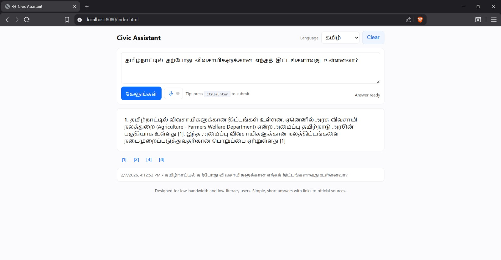

# public-civic-info-system

A serverless, citation-grounded civic information system built around a **single authoritative Core Lambda** with **thin transport adapters** (HTTP, SMS, Voice). Indexing runs as a scheduled Fargate job; inference is fully Lambda-based.

---

## 1) System overview

**Goal:** fast, safe, evidence-backed answers with auditable citations across web, SMS, and voice.

**Core design principles**

* One source of truth for policy, retrieval, generation, and validation (**Core Lambda**).
* Adapters are intentionally thin: normalize, authenticate, map errors, and format responses—**no policy decisions in adapters**.
* Deterministic chunking + idempotent indexing.
* S3 as durable system of record (metadata + audits).

---

## 2) Components & responsibilities

### A. Indexing cronjob (ECS Fargate + EventBridge)

**Schedule**

* Default: nightly
* Critical feeds: every 6 hours

**Compute**

* Fargate task: 2 vCPU, 4–8 GB RAM, parallel workers `N=4`

**Pipeline**

1. Crawl → OCR/parse
2. Deterministic chunking
3. Embed → write to **Aurora + pgvector**
4. Write per-chunk metadata + manifests to S3

**Idempotency**

```
chunk_id = sha256(raw_sha256 + ":" + start_token + ":" + end_token)
INSERT ... ON CONFLICT DO NOTHING
```

**Outputs**

* Vector DB (Aurora + pgvector)
* Per-chunk metadata in S3
* Ingestion manifests
* Logs + metrics

---

### B. Inference — Lambdas (serverless)

#### 1) Core Lambda (`core/`)

**Responsibilities**

* Request validation + policy gating
* ASR confidence gating (voice)
* Embedding + vector search
* Re-ranking (`similarity × trust × freshness`)
* Bedrock generation + strict validator
* Metadata hydration from S3
* Audit write + metrics

**Runtime & budgets**

* Python 3.11, pinned dependencies
* Lambda timeout: **10s**

  * Embed + search ≤ 2.5s
  * Generation ≤ 4.0s
  * Metadata fetch ≤ 0.3s
  * Buffer ≈ 3s

**Single tuning surface**

```
MIN_SIMILARITY, ASR_CONF_THRESHOLD, RAW_K, FINAL_K
```

#### 2) HTTP Adapter Lambda (`channels/http/handler.py`)

* API Gateway normalization → canonical Core request
* Auth (short-lived token) + CORS
* Return Core response as JSON

#### 3) SMS Adapter Lambda (`channels/sms/handler.py`)

* Normalize SNS/Twilio → canonical request
* Enforce length (≤1600 chars; split if needed)
* Map Core answer to SMS-friendly text (no `[n]` tokens)
* Append short source link **only when allowed**
* Send via SNS/Pinpoint/Twilio with rate limits

#### 4) Voice Adapter Lambda (`channels/voice/handler.py`)

**Input pipeline**

* Accept audio → S3 → start Transcribe (or streaming)
* Return `transcript + asr_confidence` to Core

**Output pipeline**

* Play Core’s signed `tts_url`
* Optional Polly fallback
* DTMF/voice options: *repeat*, *speak slowly*

> **Rule:** all policy decisions live in **Core**, never in adapters.

---

## 3) Canonical control flow (all channels)

1. Channel Lambda receives request
2. Normalize → invoke **Core Lambda synchronously**
3. Core:

   * Validate `language`, `query`, `channel`
   * If `voice`: require `asr_confidence ≥ ASR_CONF_THRESHOLD`
   * Block medical/legal intents
   * Embed → search (`RAW_K=50`) → re-rank
   * If `top_similarity < MIN_SIMILARITY` → refusal
   * Generate from **numbered passages only**
   * Validate: every sentence ends with `[n]`, valid indexes, no raw URLs
   * Hydrate citation metadata from S3
   * Write audit record + emit metrics
4. Core returns structured response
5. Adapter formats for transport (JSON / SMS text / TTS)

---


```sh


export AWS_ACCESS_KEY_ID=$AWS_ACCESS_KEY_ID              # AWS access key used for programmatic authentication (assumed pre-exported)
export AWS_SECRET_ACCESS_KEY=$AWS_SECRET_ACCESS_KEY      # AWS secret key paired with the access key (assumed pre-exported)

export AWS_REGION="ap-south-1"                            # AWS region for all deployed infrastructure and data residency
export S3_BUCKET="civic-data-raw-prod"     # S3 bucket for raw source documents, chunk storage, and citation artifacts (must be globally unique)
export PULUMI_STATE_BUCKET="pulumi-backend-670"          # S3 bucket backing Pulumi remote state for IaC deployments
export FRONTEND_UI_BUCKET="civic-bucket-for-ui"          # S3 bucket hosting the static frontend UI assets


export SEED_URLS="https://www.india.gov.in/my-government/schemes,https://www.myscheme.gov.in,https://csc.gov.in"
export ALLOWED_DOMAINS="india.gov.in,myscheme.gov.in,csc.gov.in"
export SKIP_WEB_SCRAPING=false


make create-s3
make upload-force


bash infra/scripts/local_setup.sh

# new terminal: cd inference_pipeline/frontend && python3 -m http.server 8080

```



